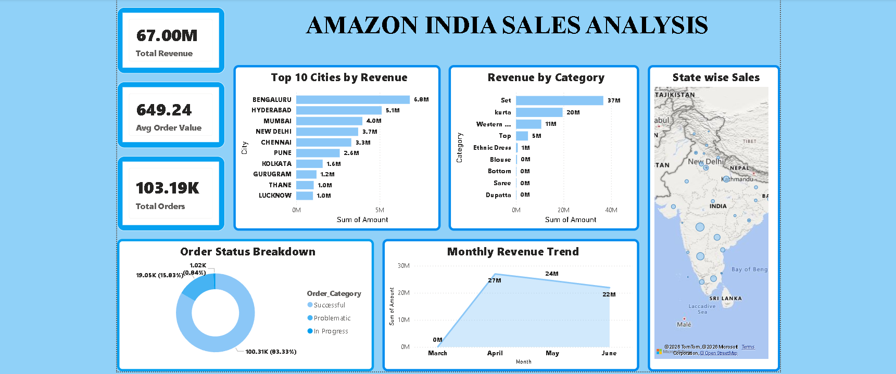
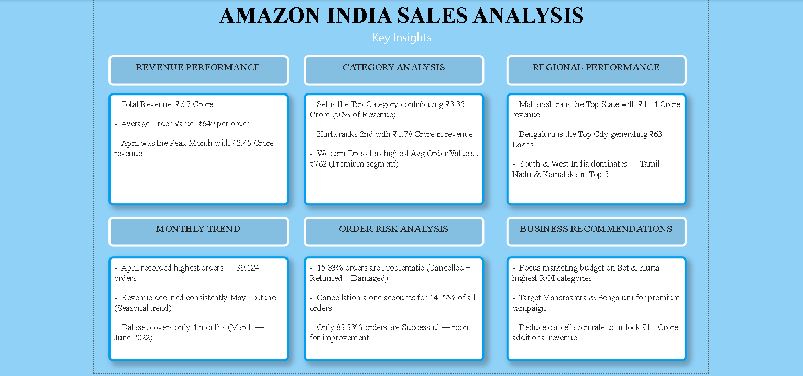

# 🛒 Amazon India Sales Analysis

## 📌 Project Overview
This project analyzes Amazon India's e-commerce sales data 
using Excel, MySQL, and Power BI to uncover key business insights.

## 🛠️ Tools Used
- **Excel** — Data Cleaning & Preparation
- **MySQL** — Data Analysis & Querying
- **Power BI** — Interactive Dashboard

## 📊 Dataset
- Source: Kaggle (Amazon Sale Report)
- Link: https://www.kaggle.com/datasets/thedevastator/unlock-profits-with-e-commerce-sales-data
- Records: 1,28,975 orders
- Period: March 2022 — June 2022
- Region: India

## 💡 SQL Analysis Performed
1. Total Revenue & Orders
2. Category wise Sales
3. State wise Revenue (Top 10)
4. Monthly Sales Trend
5. Order Status Breakdown
6. Top 10 Cities by Revenue
7. B2B vs B2C Analysis
8. Fulfilment Type Analysis

## 📈 Dashboard Preview



## 🔍 Key Insights
- 💰 Total Revenue: ₹6.7 Crore
- 📦 Total Orders: 1,03,193
- 🛍️ Avg Order Value: ₹649
- 🏆 Top Category: Set (₹3.35 Cr)
- 📍 Top State: Maharashtra (₹1.14 Cr)
- 🏙️ Top City: Bengaluru (₹63.1 L)
- ✅ Success Rate: 83.33%
- ⚠️ Problematic Orders: 15.83%

## 📁 Project Structure
```
├── dashboard                         → Screenshots
    ├── amazon-1.png                  → Sales Dashboard
    ├── amazon-2.png                  → Key Insights
├── Amazon_Sale_Report_Cleaned.csv    → Cleaned Dataset
├── Amazon_Sales_Analysis.sql         → SQL Queries
├── Amazon_India_Sales_Analysis.pbix  → Power BI Dashboard
└── README.md                         → Project Documentation
```
